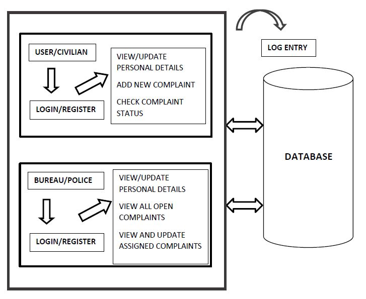

# Cyber Crime Records Management System
The objective of this project is to maintain a record of all the cyber-crime complaints reported by the victims and provide a platform for the cyber-crime bureau/police department to provide necessary solution and help to all of these problems.

## Software Configuration
* Front end: HTML5, CSS3
* Backend database: MYSQL (PhpMyAdmin)
* Server side Scripting: PHP
* Web Server: XAMPP (Apache)

## System Architecture

The architecture consists of a centralized database, which will be accessed by two types of users, civilians/victims and the bureau/police. Both of them can register and login in the system with valid credentials. They can view and update their details. Apart from that, any activity done will be logged in the logs database which is out of the system.

## Database Entities
1) User
2) Police
3) Complaint
4) Status
5) Specialization
